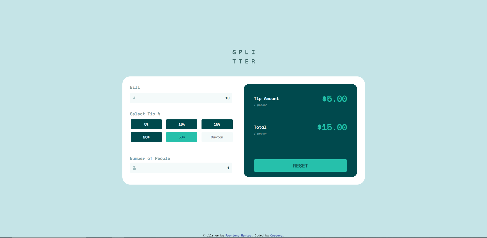
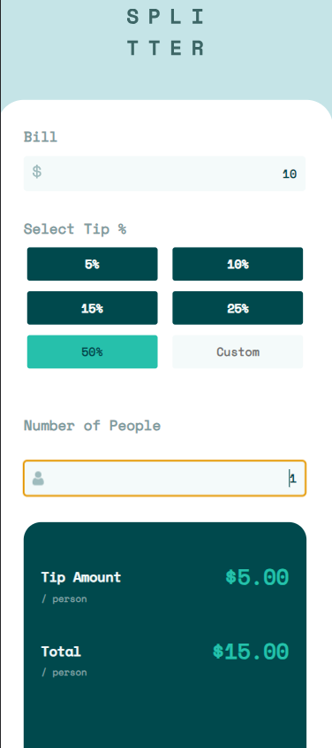

# Frontend Mentor - Tip calculator app solution

This is a solution to the [Tip calculator app challenge on Frontend Mentor](https://www.frontendmentor.io/challenges/tip-calculator-app-ugJNGbJUX).

## Table of contents

- [Overview](#overview)
  - [The challenge](#the-challenge)
  - [Screenshot](#screenshot)
  - [Built with](#built-with)
  - [What I learned](#what-i-learned)
  - [Demo](#Demo)

## Overview

This project showcases my ability to build a responsive and interactive web application that helps users calculate tips and total costs based on their bill amount, selected tip percentage, and the number of people sharing the bill.

### The challenge

The primary challenge of the Tip Calculator App is to create a user-friendly and aesthetically pleasing interface that meets the following requirements:

- Responsive Layout: The app should adapt smoothly to different device screen  sizes, providing an optimal user experience on both desktop and mobile devices.
- Interactive Elements: Interactive elements such as buttons and input fields should display hover states to enhance user feedback and engagement.
- Tip Calculation: The app should accurately calculate the tip amount and the total bill per person based on the bill amount, selected tip percentage, and the number of people.

### Screenshots

### Built with

- Semantic HTML5 markup
- CSS custom properties
- Flexbox
- CSS Grid
- JavaScript for interactivity

### What I learned

Throughout the project, I gained valuable insights and skills, including:

- Implementing responsive design techniques to create a layout that works well across various devices.
- Enhancing user experience through interactive elements and hover states.
- Performing calculations dynamically using JavaScript based on user inputs.

## Demo 
You can check out a live demo of this website [here](https://xcordeva.github.io/FrontEndMentor-Challenges/tip-calculator-app/).

